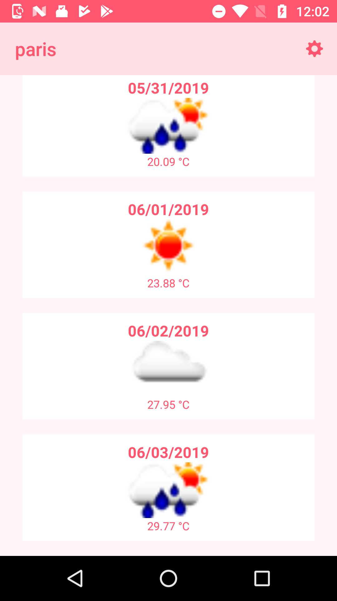
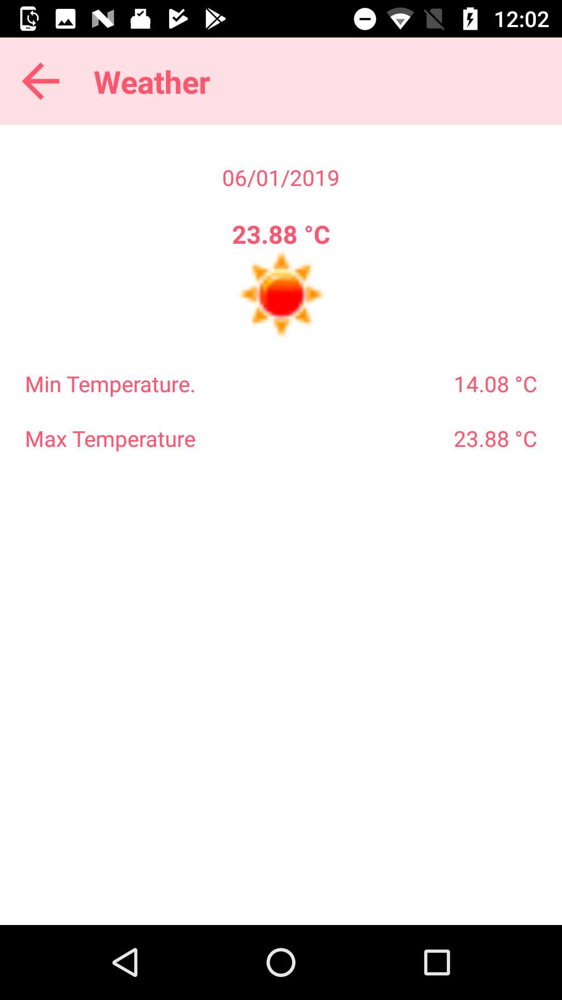

# weather-android
This application is a simple Android application written in Java that uses the Open Weather API to display the weather forecast for a given city. You can read more about Open Weather Map and their API here: https://openweathermap.org/api

## Google Play Store
This app is available on the Google Play Store here: https://play.google.com/store/apps/details?id=com.robinkanatzar.weather&hl=en

## Configuration
* Sign up for a free developer account at https://openweathermap.org/api
* Download the project from Github.
* Copy your Open Weather Map API key into the BASE_URL value in Constants.java in this project.
* Run the app.
